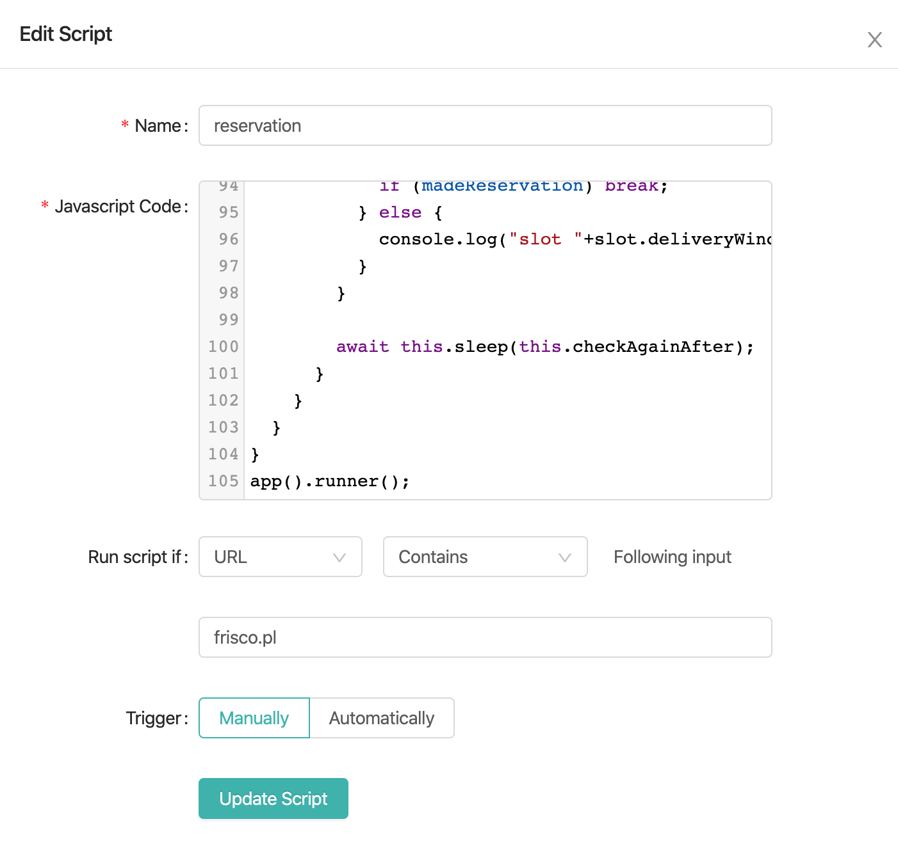

# README #

## Usage

### Chrome Extension
Install <Scripty/> from [here](https://chrome.google.com/webstore/detail/scripty-javascript-inject/milkbiaeapddfnpenedfgbfdacpbcbam)

### Configuring Extension

1. Add New Script
2. Give name, copy paste script itself
3. Set to run on frisco domain and it's triggered manually

### Running

Login on frisco.pl
Open debug mode -> Network

Get user ID from the path:
`/api/users/USER_ID/cart`

Copy values for headers:
`Authorization` (omit `Bearer`, this is the token)
`x-frisco-division`
`x-frisco-features`
`x-frisco-visitorid`

Update all in the script

Update `deliveryDate` 

